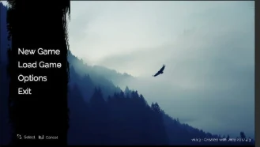
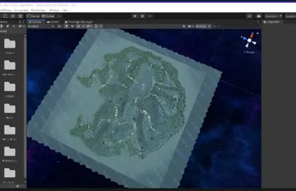

# ZMB

<p align="center">
  <strong>First-Person 3D Survival Prototype Developed in Unity and C#</strong>
</p>

<p align="center">
  Player movement, NavMesh-driven enemy behavior, recurring encounter generation, health management, animation, and modular gameplay systems.
</p>

---

## Visual Overview

<p align="center">
  
</p>

<p align="center">
  <strong>Atmospheric visual identity developed for the ZMB prototype.</strong>
</p>

| Main Menu | Unity World Overview |
|:---:|:---:|
|  |  |
| Runtime menu with New Game, Load Game, Options, and Exit flows. | Large-scale terrain and environment development inside the Unity Editor. |

---

## Project Overview

**ZMB** is a first-person 3D game-development prototype created in Unity. The project explores the integration of player control, enemy navigation, encounter generation, health management, animation, environmental interaction, and combat-oriented gameplay within a single real-time application.

Rather than being presented as a finished commercial title, ZMB functions as a practical development environment for studying how independent gameplay systems are connected through Unity components and C# scripts. The repository documents both custom project logic and integrated asset packages used during prototyping.

The current implementation is intended to demonstrate the technical foundations of a survival-style experience in which the player navigates a large atmospheric 3D environment while dynamically generated enemies pursue and engage the player.

---

## Technical Profile

| Category | Implementation |
| --- | --- |
| Engine | Unity 2020.1.9f1 |
| Programming language | C# |
| Perspective | First-person 3D |
| Environment | Large terrain-based Unity scene |
| Player locomotion | `CharacterController`-based movement |
| Enemy navigation | Unity `NavMeshAgent` |
| Enemy generation | Coroutine-driven recurring spawner |
| Animation | Unity Animator integration |
| Interface layer | Runtime menu, Unity UI, and TextMeshPro packages |
| Physics | Unity 3D physics modules |
| License | MIT |

---

## Core Gameplay Architecture

### First-Person Player Controller

The player controller uses Unity's `CharacterController` component to implement:

- Camera-relative first-person movement.
- Walking and sprinting states.
- Mouse-based horizontal and vertical viewing.
- Configurable movement and rotation sensitivity.
- Jump behavior and gravity handling.
- Restricted vertical camera rotation for controlled first-person navigation.

The controller separates movement, rotation, and camera behavior into clear responsibilities, providing a reusable base for further gameplay development.

### Enemy Navigation and Behavior

Enemy behavior is implemented through Unity's navigation and animation systems. The current logic includes:

- Automatic acquisition of the player as a target.
- `NavMeshAgent`-based pursuit.
- Distance-based interaction state changes.
- Orientation checks before initiating an action.
- Configurable movement and angular speed.
- Animator-triggered state transitions.
- Coordination with player and enemy health components.

This architecture provides a foundation for extending the enemies with additional states such as patrol, search, avoidance, prioritization, and difficulty scaling.

### Encounter Generation

The enemy-generation system discovers configured spawn points and periodically instantiates enemy prefabs through a coroutine. Spawn timing and generation locations remain configurable from the Unity Inspector.

This modular approach separates encounter pacing from the individual enemy logic and makes it possible to refine level progression without rewriting the navigation system.

### Health and State Management

Dedicated components coordinate the health state of the player and enemies. These systems are connected to navigation, animation, object lifecycle, and gameplay-state transitions.

The implementation provides a base for later extensions such as:

- Difficulty-dependent health values.
- Progressive encounter intensity.
- Recovery or temporary protection states.
- Score and progression tracking.
- Restart and game-over flows.

### Combat and Interaction Layer

The project integrates custom controller scripts with a modular third-party combat package. This layer provides reusable components for projectiles, effects, object pooling, camera feedback, and related gameplay interactions.

External packages are maintained separately from the project's own scripts so that custom logic can be identified and evolved independently.

---

## Custom Project Scripts

The principal project-specific scripts are located under:

```text
OneDrive/Unity/ZMB/Assets/Script/
```

Key components include:

| Script | Responsibility |
| --- | --- |
| `PlayerController.cs` | First-person movement, camera control, sprinting, jumping, and gravity. |
| `LogicaJugador.cs` | High-level player state and gameplay behavior. |
| `LogicaEnemigo.cs` | Enemy targeting, pursuit, orientation checks, interaction states, and animation control. |
| `GeneradorDeEnemigos.cs` | Recurring enemy generation across configured spawn points. |
| `Vida.cs` | Shared health and damage-state management. |
| `PlayerWeaponController.cs` | Connection between player input and the combat system. |
| `WeaponController.cs` | Runtime control of the active combat component. |

---

## External and Integrated Assets

The Unity project includes third-party or demonstration packages used to accelerate prototyping, including:

- A modular combat and projectile package.
- Camera-feedback and vibration components.
- Demonstration utilities and sample controllers.
- Unity TextMeshPro, Timeline, UI, physics, animation, audio, AI, terrain, and related engine modules.

These resources should be reviewed individually before redistribution outside the repository, as third-party asset licensing may differ from the MIT license applied to the original project code.

---

## Repository Structure

```text
ZMB-game/
├── README.md
├── LICENSE
├── assets/
│   └── figures/
│       ├── zmb_cover_art.webp
│       ├── zmb_main_menu.webp
│       └── zmb_unity_world_overview.webp
└── OneDrive/
    └── Unity/
        └── ZMB/
            ├── Assets/
            │   ├── Script/
            │   ├── Easy Weapons/
            │   ├── SMC Pack 1/
            │   └── additional game assets
            ├── Packages/
            │   └── manifest.json
            ├── ProjectSettings/
            │   ├── ProjectVersion.txt
            │   └── ProjectSettings.asset
            └── Assembly-CSharp.csproj
```

The actual Unity project root is:

```text
OneDrive/Unity/ZMB/
```

---

## Opening the Project

For the most compatible setup:

1. Install **Unity Hub**.
2. Install **Unity 2020.1.9f1**.
3. Clone or download the repository.
4. In Unity Hub, select **Add project from disk**.
5. Choose:

```text
OneDrive/Unity/ZMB/
```

6. Allow Unity to restore packages and rebuild its local project cache.
7. Open the primary scene from the Unity Editor and review any missing package or asset references before entering Play Mode.

A newer Unity version may upgrade serialized assets and project settings. Creating a backup branch before migration is recommended.

---

## Development Considerations

### Project Organization

The Unity project is currently stored inside a historical `OneDrive/Unity/ZMB/` path. A future cleanup could move the Unity root to the repository root or to a simpler `Game/` directory while preserving asset references through a controlled Git commit.

### Generated Unity Files

Directories such as the following should normally remain excluded from version control:

```text
Library/
Temp/
Obj/
Logs/
UserSettings/
Build/
Builds/
```

Only reproducible source assets, project settings, package manifests, and original scripts should be treated as essential repository content.

### Asset Size

The repository contains substantial binary game assets. Future maintenance may benefit from:

- Git LFS for large binary resources.
- Removal of unused demonstration content.
- Clear separation between original and third-party assets.
- Optimized textures, audio, meshes, and animation files.
- Dedicated build releases rather than committing generated builds.

---

## Engineering Value

ZMB demonstrates the integration of multiple real-time software systems:

- Frame-based player input and camera control.
- Character locomotion and gravity.
- Navigation-mesh path planning.
- Target tracking and state-dependent enemy behavior.
- Coroutine-based content generation.
- Animator coordination.
- Component-based health management.
- Menu and scene-flow foundations.
- Large-environment construction inside Unity.
- Modular interaction systems.
- Unity package and asset integration.

The project is particularly useful as a record of practical Unity development and as a foundation for refactoring toward clearer state machines, improved architecture, better asset management, and more structured gameplay progression.

---

## Development Status

ZMB is an experimental prototype and learning-oriented game project. The repository contains functional gameplay foundations, an atmospheric terrain environment, and an initial runtime menu, but should not be interpreted as a production-ready release.

Future development may focus on:

- Formal enemy finite-state machines.
- Improved scene and level organization.
- Configurable encounter progression.
- Complete menu, loading, options, and game-state flows.
- Audio and visual feedback refinement.
- Performance profiling and terrain optimization.
- Automated tests for reusable gameplay components.
- Migration to a supported Unity Long-Term Support release.

---

## License

The repository is distributed under the **MIT License**. Third-party Unity assets and packages may retain their own license conditions and should be reviewed separately before reuse or redistribution.

---

<p align="center">
  <strong>Atmospheric world-building, real-time systems, and practical Unity engineering in a single prototype.</strong>
</p>
